# Dataflow diagram

The data flow diagram illustrates the various data flows within different status stages of the application.
It categorizes the flows based on whether they occur automatically or manually, indicating the responsible actor, the target system, the specific data involved, and any manual steps required in the process.

Notably, it does not display all non-automatic status transitions that must be manually set by the user (caseworker).
For a comprehensive view of all status transitions, one should refer to the [status values page](./status-values).

## Legend

The colors used in the diagram (blue and orange) correspond to those in the status diagram and are further clarified in the legend, which includes explanations of all symbols used.

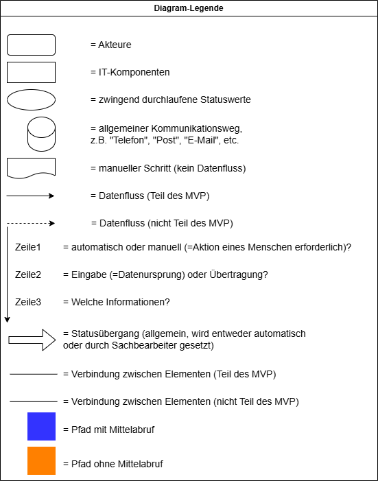

## Necessary states for application-approval

### Offen

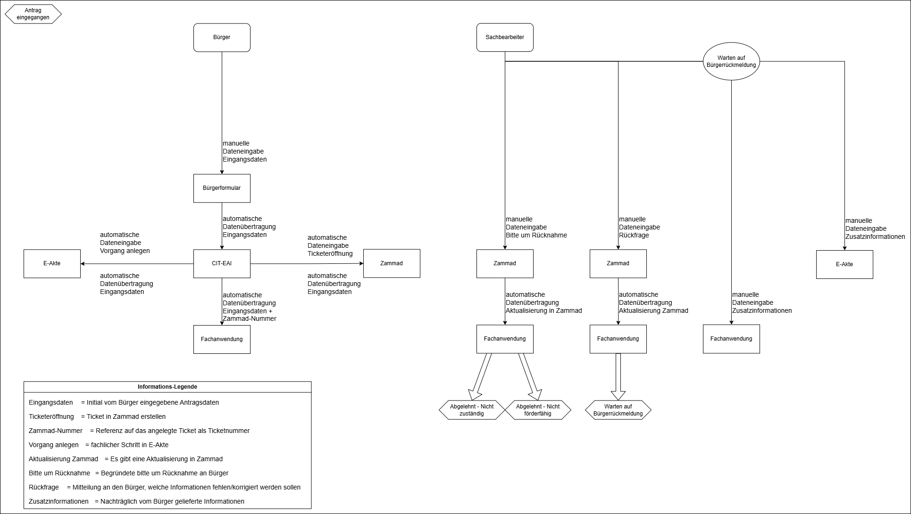

### Vorbereitung

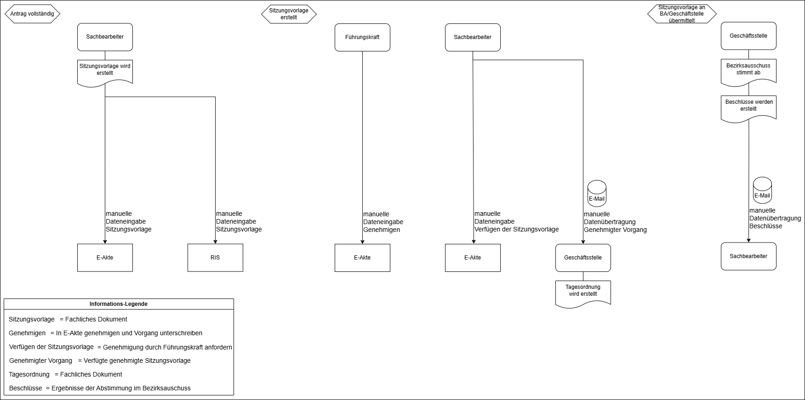

### Angenommen

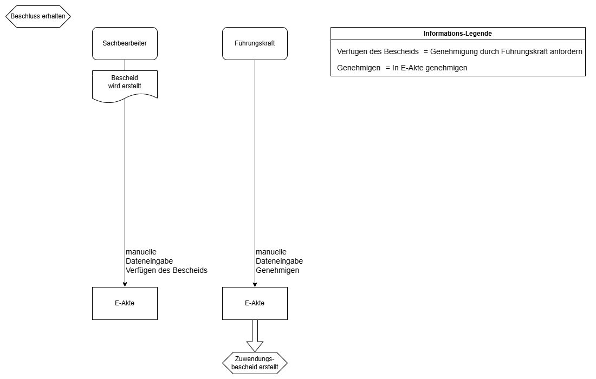

### Bewilligt

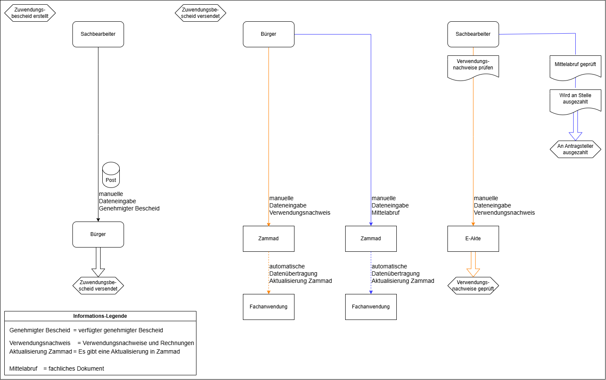

### Nachricht an Bürger

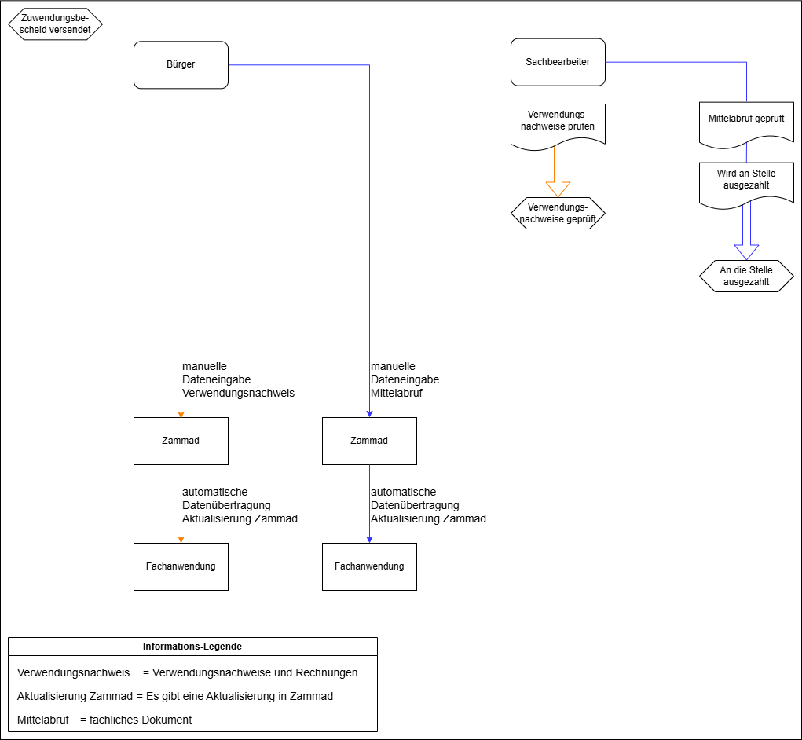

### Finanzierung

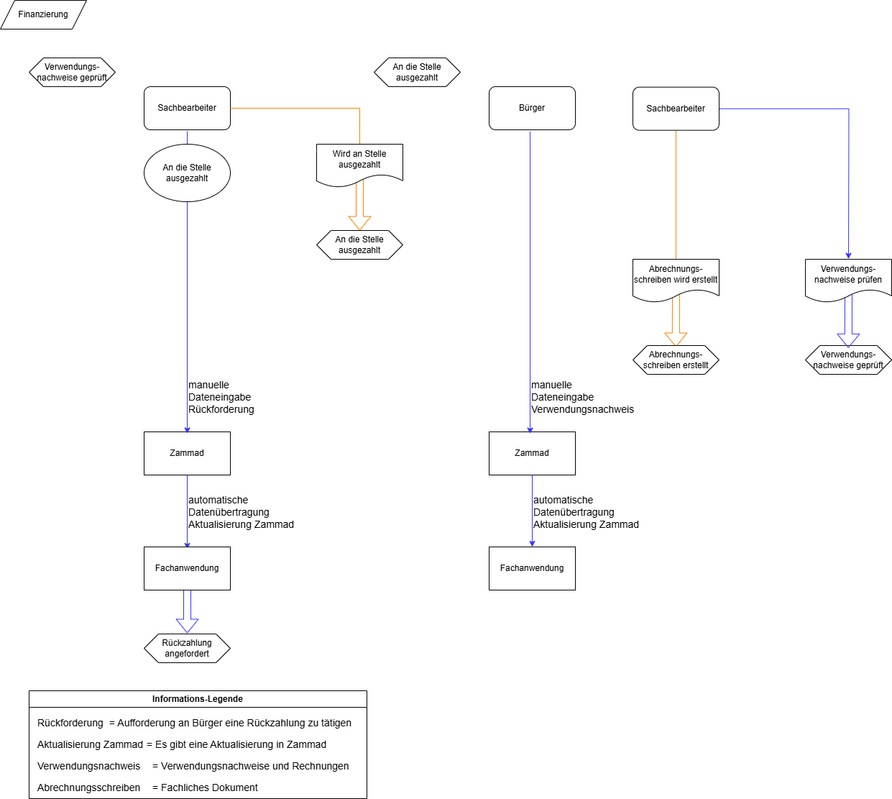

### Abgeschlossen

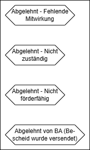

## Further states

### Rückzahlung

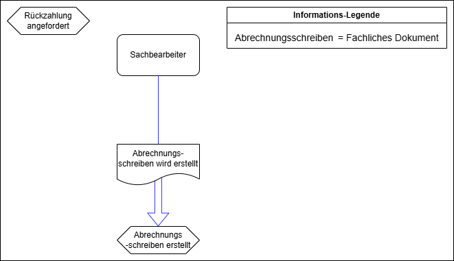

### Warten

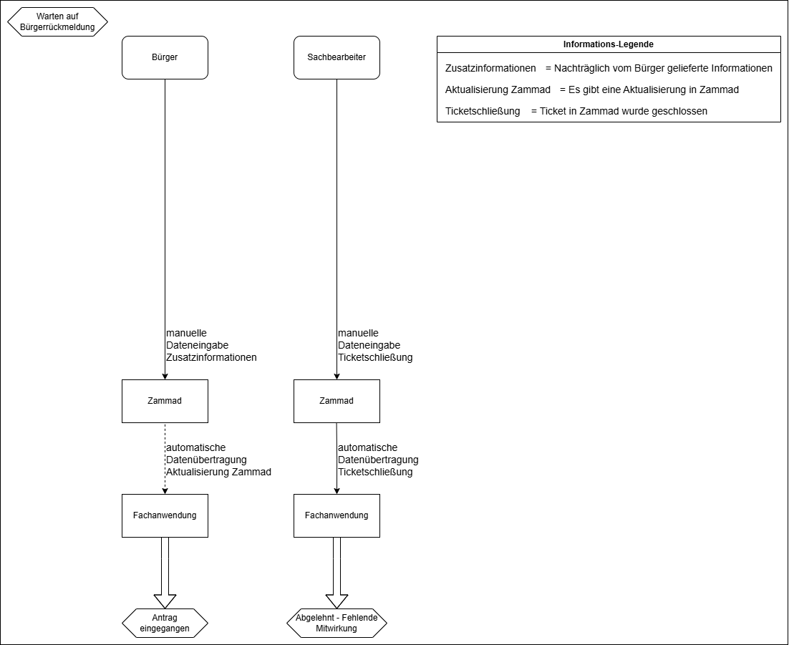

### Zurückgewiesen

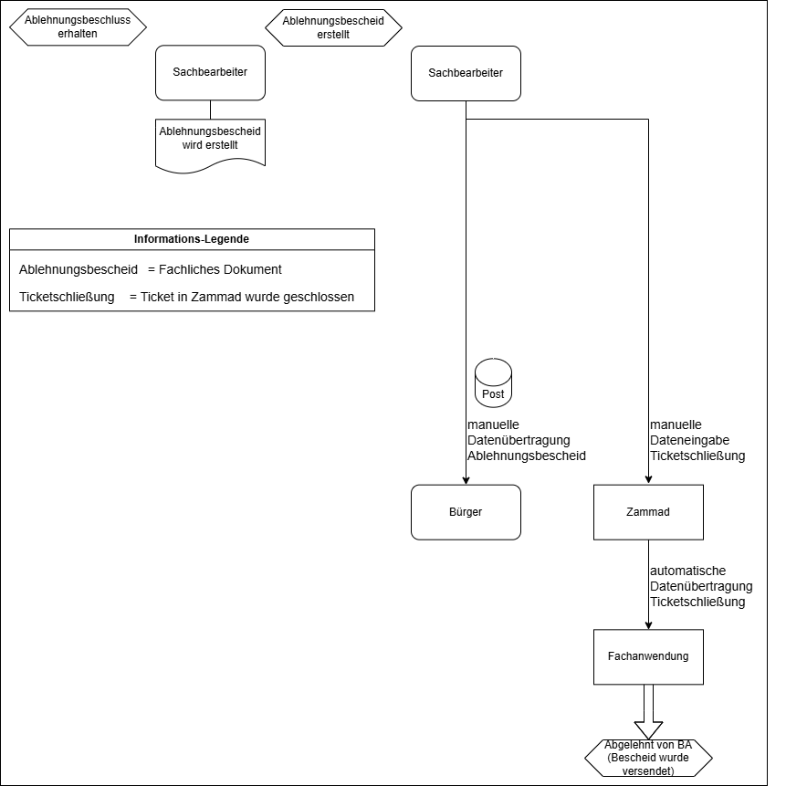

### Abgelehnt

