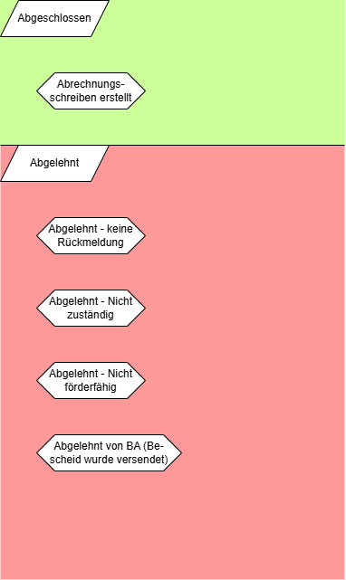

# Dataflow Diagram

## Description & Legend

## Necessary states for application-approval

### Offen

### Vorbereitung

### Angenommen

### Bewilligt

### Nachricht an Bürger

### Finanzierung

### Abgeschlossen/Abgelehnt

## Special states

### Rückzahlung

### Warten

### Zurückgewiesen

