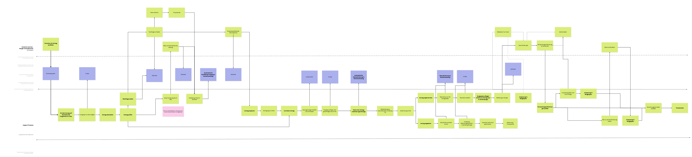

# About

## Introduction

The application process within the city district is designed to facilitate effective communication between citizens and caseworkers, as well as among caseworkers, district committees, and other involved parties. This documentation outlines the intended workflow of our specialized application, which aims to streamline the submission and processing of applications.

At the core of this process, several systems work in tandem to ensure a smooth experience for all users. The **Form Server** serves as the entry point for citizens to input their application data. Once submitted, the **Zammad** system enables seamless communication between citizens and caseworkers, ensuring that inquiries and updates are managed efficiently.

Additionally, the **E-Akte** system plays a crucial role in documenting the entire application process, providing a comprehensive record of actions taken and decisions made. Our specialized application further enhances this workflow by presenting a clear overview of the application status to caseworkers, highlighting next steps and actions required.

This documentation will guide users through the intended process, illustrating how these systems interact and how the specialized application simplifies the application management experience for both citizens and caseworkers.

## Architecture

- **Form Server**: The platform where citizens enter their request data.
- **Zammad**: The communication tool that connects citizens with caseworkers.
- **E-Akte**: The documentation system that tracks the request process.
- **Specialized Application**: The tool that visualizes the request status for caseworkers and indicates subsequent steps.

By integrating these systems, the application process aims to enhance efficiency, transparency, and user satisfaction in the handling of applications within the city district.

For more details, visit the [architecture documentation](../architecture/)

## Target process

<a href="./Soll-Prozess.png" target="_blank" rel="noopener noreferrer">Open in new tab</a>

The target process provides a visual representation of the intended workflow and interactions between all parties involved in the application process.
