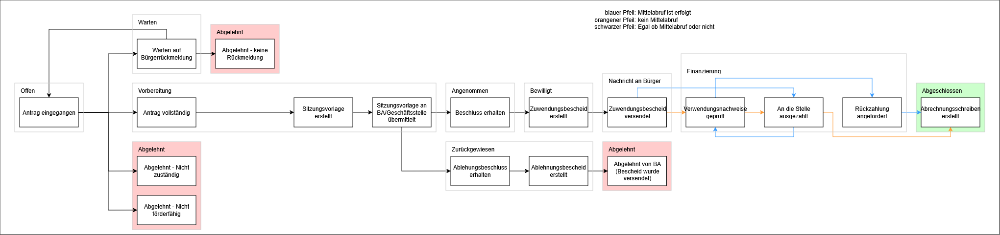

# Status values

The following diagram is showing all status values, including their transitions and simplification names, that combine one or more status values. These grouping
names will be shown in the application, to reduce 18 values into 10 short names.

All red-colored and green-colored areas represent final status values, meaning the application has been accepted (green) or has been declined (red).
