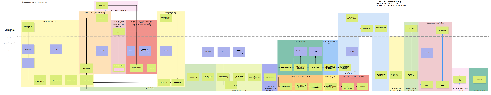

# Target process

The target process provides a visual representation of the intended workflow and interactions between all parties involved in the application process.

::: info
The colored boxes in the diagram represent different statuses within the process, which correspond to the internal statuses in our data model.
:::
