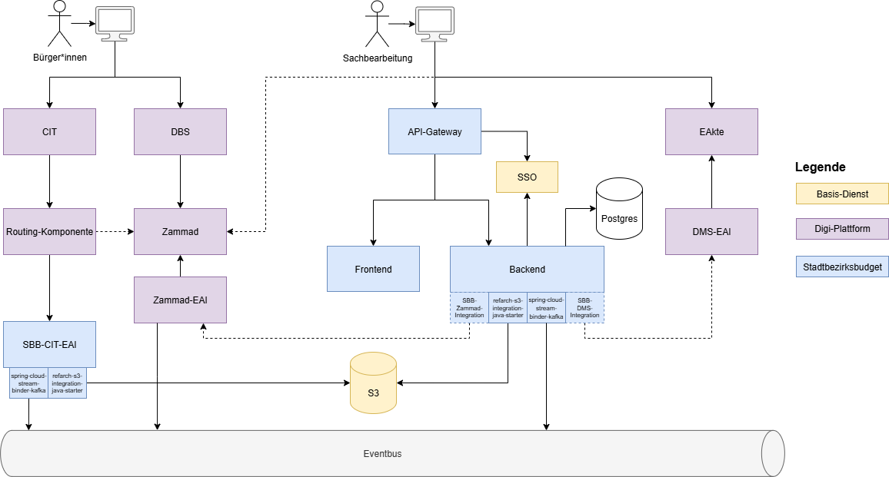

# Architecture

The following section presents the architecture diagram, illustrating the core systems and their interactions within the Stadtbezirksbudget application. This
visual overview highlights how the form server, communication tools, documentation systems, and the specialized application work together to streamline the
application process.

## Architecture Diagram

::: info
The architecture diagram contains dashed boxes and lines that are not part of the MVP (Minimum Viable Product) and will not be implemented in the first version.
:::

## Components

The architecture consists of the following key components:

### Stadtbezirksbudget Application

The Stadtbezirksbudget application is the core system that caseworkers use to manage and process applications.

### PostgreSQL Database

Application data, except for attachments, is stored in a PostgreSQL database.

### CIT Form Server

The Form Server is the platform where citizens enter their application data. It serves as the initial point of contact for users, providing a user-friendly
interface for submitting requests.

### SBB-CIT-EAI

The SBB-CIT-EAI component acts as an intermediary, managing the flow of data between the Form Server and the Stadtbezirksbudget application. It ensures that
information is accurately transmitted via the event bus and an S3 storage.

### DBS (Zammad)

Zammad is the communication tool that connects citizens with caseworkers. It facilitates seamless interactions, allowing for inquiries, updates, and
notifications throughout the application process.

### Event Bus (Kafka)

The Event Bus, powered by Kafka, facilitates high-availability communication between the CIT Form Server and the Stadtbezirksbudget application.

### S3 Storage

S3 Storage is used to centrally store all attachments, making them reliably accessible throughout the application process.

### E-Akte

E-Akte is the documentation system that tracks the entire application process. It maintains a comprehensive record of actions taken, decisions made, and
communications exchanged, ensuring auditability and accountability.

### SSO (Keycloak)

Keycloak provides Single Sign-On (SSO) capabilities, enabling streamlined access to the application for caseworkers.
