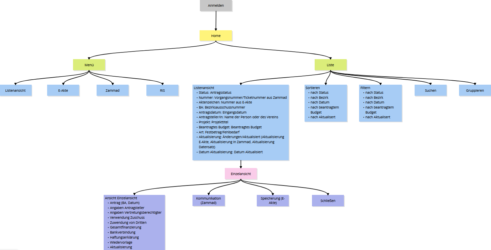

# Information Architecture

Information architecture describes the structure, organization, and presentation of information within a system. It defines how data and content are logically
arranged, interconnected, and made accessible to users, supporting efficient navigation.

