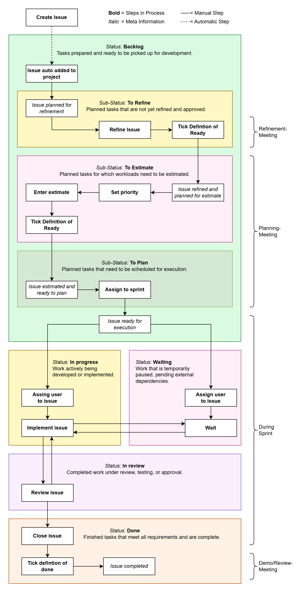

# GitHub Projects workflow

In our Scrum project managed through [GitHub Projects](https://github.com/features/project-management), understanding
the lifecycle of issues is crucial for effective project management. The lifecycle encompasses various stages that
issues go through, from their initial creation to final resolution. Key phases include identification, prioritization,
development, review, and closure, all of which highlight the workflow adopted by our team.

The following diagram illustrates this lifecycle, serving as a reference for all stakeholders to enhance
collaboration and streamline our agile processes.

## Status Values

In our Scrum project, we utilize the following status values to track the progress of issues within GitHub Projects.
Each status helps the team understand the current state of work and facilitates efficient project management.

1. **Backlog**
   - **Definition:** Tasks that have been prepared and are ready to be picked up for development.
   - **Purpose:** This status serves as a queue for upcoming work, allowing team members to easily identify tasks that
     are ready to start.

2. **In Progress**
   - **Definition:** Work that is actively being developed or implemented.
   - **Purpose:** This status indicates that a task is currently being worked on, providing visibility into ongoing
     activities within the team.

3. **Waiting**
   - **Definition:** Work that is temporarily paused, pending external dependencies.
   - **Purpose:** This status helps to highlight tasks that cannot proceed due to factors outside the team's control,
     ensuring that these items are monitored until they can be resumed.

4. **In Review**
   - **Definition:** Completed work that is under review, testing, or approval.
   - **Purpose:** This status signifies that a task has been finished but is awaiting feedback or validation from team
     members or stakeholders before it can be considered complete.

5. **Done**
   - **Definition:** Finished tasks that meet all requirements and are considered complete.
   - **Purpose:** This status marks the final stage of an issue’s lifecycle, allowing the team to track completed work and
     assess project progress.

These status values form the backbone of our issue management process, enabling clear communication and efficient workflow
throughout the project.

### Backlog Sub-Statuses

Within the Backlog status, we utilize the following sub-status values to further categorize planned tasks:

1. **To Refine**
   - **Definition:** Planned tasks that are not yet refined and approved.
   - **Purpose:** This sub-status indicates tasks that require further clarification or detailing before they can proceed
     to the next steps.

2. **To Estimate**
   - **Definition:** Planned tasks for which workloads need to be estimated.
   - **Purpose:** This sub-status highlights tasks awaiting workload assessment to enable better planning and resource
     allocation.

3. **To Plan**
   - **Definition:** Planned tasks that need to be scheduled for execution.
   - **Purpose:** This sub-status signifies tasks that are ready for scheduling, ensuring that they are organized for
     future work cycles.

## Priority Levels

In our project management process, we assign the following priority levels to issues to ensure that tasks are addressed
according to their urgency and importance:

1. **Critical**
   - **Definition:** Requires immediate attention; blockers or issues that prevent progress and must be resolved urgently.
   - **Purpose:** Critical tasks are prioritized to ensure that the team can continue to move forward without
     significant delays.

2. **High**
   - **Definition:** Important tasks with significant impact; should be prioritized soon after critical issues.
   - **Purpose:** High-priority tasks are essential for project success and should be addressed promptly to maintain momentum.

3. **Medium**
   - **Definition:** Standard priority; valuable but not urgent, can be scheduled after higher priorities.
   - **Purpose:** Medium-priority tasks contribute to the project but can be attended to once critical and high-priority
     issues are resolved.

4. **Low**
   - **Definition:** Nice-to-have or minor tasks; lowest urgency, can be addressed if time and resources allow.
   - **Purpose:** Low-priority tasks are less critical and can be scheduled at the team's discretion when there is
     available capacity.

## Estimate Field

In our project management process, we utilize the Estimate field to assess the complexity of issues using Fibonacci numbers.
This approach allows the team to provide a relative measure of effort required to complete a task, facilitating better
planning and resource allocation. The Fibonacci sequence used for estimation typically includes values such as 0, 1, 2, 3,
5, 8, and 13.

By using Fibonacci numbers, the team can effectively communicate and align on the perceived complexity of tasks, helping
to prioritize and plan work more efficiently.

## Sprint Field

The Sprint field is used to designate the specific sprint during which an issue is planned to be addressed. Our team
typically operates on a three-week sprint cycle. This duration allows for focused development and review periods,
promoting effective progress on tasks while ensuring time for feedback and adjustments.

By assigning issues to specific sprints, we can better manage our workload, track progress, and ensure that tasks are
completed in a timely manner within our agile framework.
