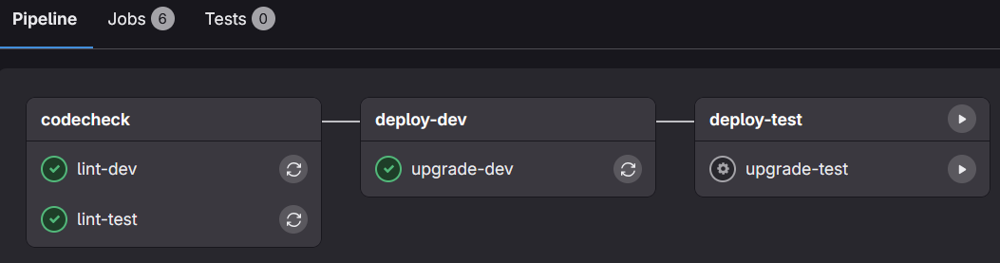

# Release process

The software release process helps maintain version control and ensures smooth, reliable updates. It marks the end of a development cycle by delivering new features and enhancements to users.

## Versioning

Version numbers are typically in the format `X.Y.Z`, where each component has a specific meaning:

- **Major (X)**: Incremented for significant updates that may include large new features, major improvements, or changes that are not backward-compatible.
- **Minor (Y)**: Incremented when new, backward-compatible features are added. Minor updates enhance functionality without changing the core architecture.
- **Patch (Z)**: Incremented for small changes such as bug fixes, security patches, or minor improvements that do not add new features.

## 1. Create a release branch

- Open the repository's [branches](https://github.com/it-at-m/stadtbezirksbudget/branches).
- Click "New branch".
- Enter the branch name `release/vX.Y.Z` (see [Versioning](#versioning) for details).
- Click "Create new branch".

## 2. Run release workflows

For each service in the repository, run the corresponding release workflow to automatically build the service, create a GitHub release, and publish a tagged Docker image.

For Java services, use the Maven release workflow; for Node.js services, use the npm release workflow.

::: danger
Do **not** run these workflows in parallel. Start one workflow, wait for it to finish, then run the next.

This is necessary because the workflows check out the branch and commit to it; they cannot automatically merge concurrent changes.
:::

### Maven release

- Open the [maven release workflow](https://github.com/it-at-m/stadtbezirksbudget/actions/workflows/maven-release.yml) for the repository.
- Expand "Run workflow".
- Select your release branch.
- Enter your release version in the "Version to use when preparing a release (e.g., 1.2.3)" field (only digits and dots), e.g., `1.2.3`.
- In the "Version to use for new local working copy (e.g., 1.2.4-SNAPSHOT)" field enter the next development version by incrementing the patch number and appending `-SNAPSHOT` (for example, if releasing `1.2.3`, enter `1.2.4-SNAPSHOT`).
- Select the service in the "Service-Name" field that you want to release.
- Click "Run workflow".
- Wait for the workflow to finish.

For reference: with branch `release/v0.5.0` and release version `0.5.0`, the "Version to use for new local working copy" would be `0.5.1-SNAPSHOT`. Example service: `stadtbezirksbudget-backend`.

{width=250px}

### Npm release

- Open the [npm release workflow](https://github.com/it-at-m/stadtbezirksbudget/actions/workflows/npm-release.yml) for the repository.
- Expand "Run workflow".
- Select your release branch.
- Choose the version increment type (following Semantic Versioning).
- Select the Node.js service to release.
- If you do not want to publish to the npm registry, tick the "Skip deployment to npm registry" box.
- Click "Run workflow".
- Wait for the workflow to finish.

For reference: with branch `release/v0.5.0` and a "minor" increment for the `stadtbezirksbudget-frontend` service, the workflow will prepare the appropriate version bump.

{width=250px}

## 3. Merge the release branch

- Open the [compare view](https://github.com/it-at-m/stadtbezirksbudget/compare) of the repository.
- Select your release branch in the compare field.
- Click "Create pull request" (or "View pull request" if one already exists).
- Enter a clear title, for example `🔖 Release vX.Y.Z`.
- Optionally add more details to the pull request.
- Click "Create pull request".
- Wait for review and approval from another team member.
- After approval, merge the pull request.

For reference: here is an example with branch `release/v0.5.0`:

## 4. Update deployment (internal)

::: info
The following steps are performed in the internal infrastructure repository and are not publicly accessible. They are documented here for completeness and to provide an overview of the full release process.
:::

### Update version tags and commit changes

- Open the Helm values file for the environment you want to update, e.g., [`values-test.yaml`](https://git.muenchen.de/stadtbezirksbudget/sbb-infrastructure/-/edit/main/values-test.yaml) for the test environment.
- Replace outdated version tags with the new release tag. For example, for release `0.5.0`, change `tag: "0.4.X"` to `tag: "0.5.0"`.
- Commit the changes.
- Use the commit message `🔖 Release X.Y.Z` (see [Versioning](#versioning) for the version format).
- Commit to a new branch named `release/vX.Y.Z`.
- Check "Create a merge request for this change" (internal workflow).

{width=400px}

### Merge and deploy changes

- Create a merge request from your release branch to `main`.
- Wait for review and approval from another team member.
- Merge the request after approval.
- Wait for the pipeline to finish.
- Open the pipeline details and start the `deploy-test` job (click the play icon).
- Wait for the deployment pipeline to complete.

{width=500px}
