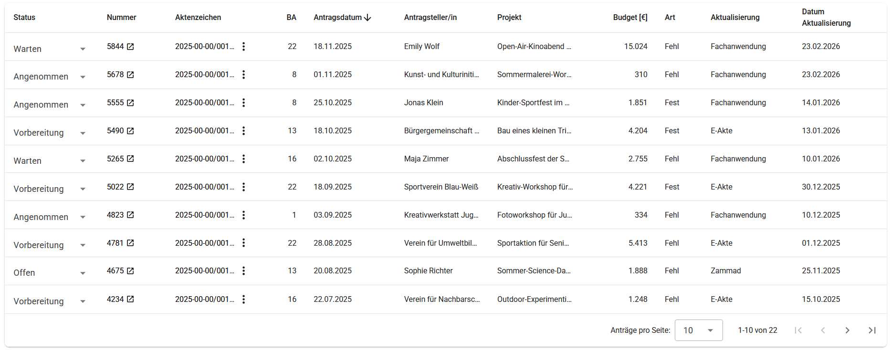
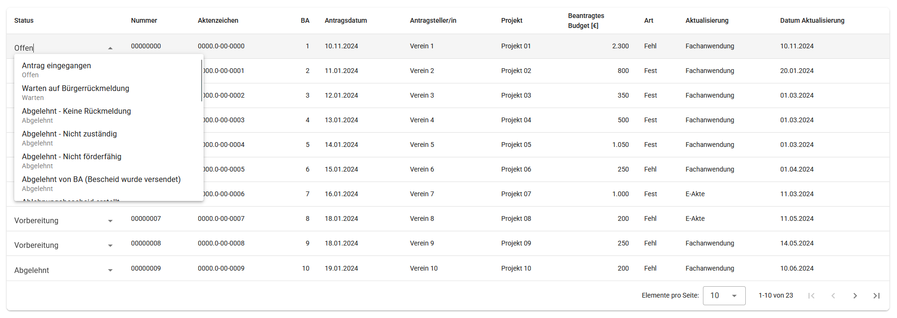
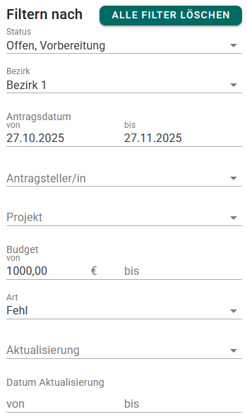
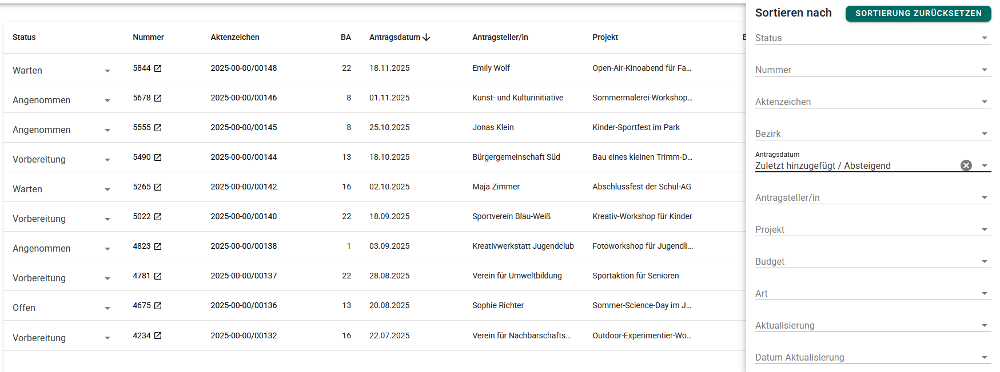

# Application list

The application list is the main interface on the home page of the project. It provides an overview of all applications submitted by citizens, allowing
caseworkers to efficiently manage and process them. It displays key information about each application, such as the applicant's name, submission date, current
status, and any relevant actions that need to be taken. The list is designed to be user-friendly, enabling caseworkers to quickly identify applications that
require attention and to navigate through the applications with ease.

## Column contents

The displayed columns represent the most important data from the citizen form, such as the applicant or project title. Additionally, a few additional columns
provide context and facilitate the processing of applications:

| Column               | Description                                                                                                     |
| -------------------- | --------------------------------------------------------------------------------------------------------------- |
| Status               | The current [status](/about/status-values) of the application, indicating its stage in the processing workflow. |
| Nummer               | The Zammad ticket number associated with the application.                                                       |
| Aktenzeichen         | Identifier in the E-Akte system where the application is documented.                                            |
| BA                   | The administrative district (Bezirk) relevant to the application.                                               |
| Antragsdatum         | The date when the application was submitted by the applicant.                                                   |
| Antragsteller        | The name of the applicant who submitted the application.                                                        |
| Projekt              | The name of the project for which the application was made.                                                     |
| Beantragtes Budget   | The amount of budget requested in the application.                                                              |
| Art                  | The type of application submitted ("Fehl" or "Fest").                                                           |
| Aktualisierung       | Shows in which of the involved systems (Zammad, EAkte) the last activity occurred.                              |
| Datum Aktualisierung | The date when the last update was made to the application.                                                      |

## Updating application status

The application status can be updated directly from the application list. Caseworkers can select an application and change its status based on the current stage
of processing. This feature streamlines the workflow by allowing quick updates without needing to navigate to a separate page for each application.

## Filtering of the list

The application list can be filtered based on various criteria to help caseworkers quickly find the applications they need to review.

These filters can be combined to narrow down the list of applications and make it easier to manage them effectively, e.g. the filters of the image above show
all applications where all the following conditions are met:

- The status is "_Offen_" or "_Vorbereitung_"
- The Bezirk is "_Bezirk 1_"
- The application was created between 27.10.2025 and 27.11.2025
- The amount requested is greater than or equal to 1,000 EUR
- The type of the application is "_Fehl_"

## Sorting of the list

The application list can be sorted by clicking on the column headers or through the according sort menu.
This allows caseworkers to organize the applications based on different criteria.

Only one column can be used for sorting at a time. An arrow icon next to the column header indicates the current sort
order (ascending or descending).
