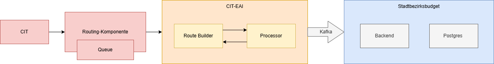

# CIT Integration

The CIT integration is used to transfer application data from the online form infrastructure to the Stadtbezirksbudget application.

## CIT-EAI

The CIT-EAI acts as the integration layer between the online form infrastructure and the Stadtbezirksbudget application.

After submission of the online form, the form server sends the application data as an XML message to a queue.
The routing component forwards the message as an **exchange via a stream** to the CIT-EAI.

Within the CIT-EAI the application data is processed as follows:

- The incoming exchange containing the XML payload is received via a stream.
- The XML message is parsed and mapped to an internal Data Transfer Object (DTO).
- The DTO is transformed into a JSON representation.
- The message flow is defined using a Route Builder, while a Processor handles the transformation logic.

After successful processing, the JSON message is published to Kafka.

## Kafka

Kafka is used as the messaging layer between the CIT-EAI and the Stadtbezirksbudget application.

The processed application data is sent as a Kafka message, enabling asynchronous and decoupled communication between the systems.

## Stadtbezirksbudget Application

The Stadtbezirksbudget application is the main system responsible for processing and persisting application data.

The backend consumes the Kafka messages produced by the CIT-EAI and performs the following steps:

- The JSON message is received from Kafka.
- The payload is mapped to domain objects.
- The application services (Antragservices) process the data and apply business logic where required.
- The data is mapped to persistence entities and stored in the PostgreSQL database.

## Summary

The CIT integration ensures a reliable end-to-end data flow from the online form to the Stadtbezirksbudget database:

This integration enables scalable, asynchronous processing while keeping the Stadtbezirksbudget application decoupled from the online form infrastructure.
 