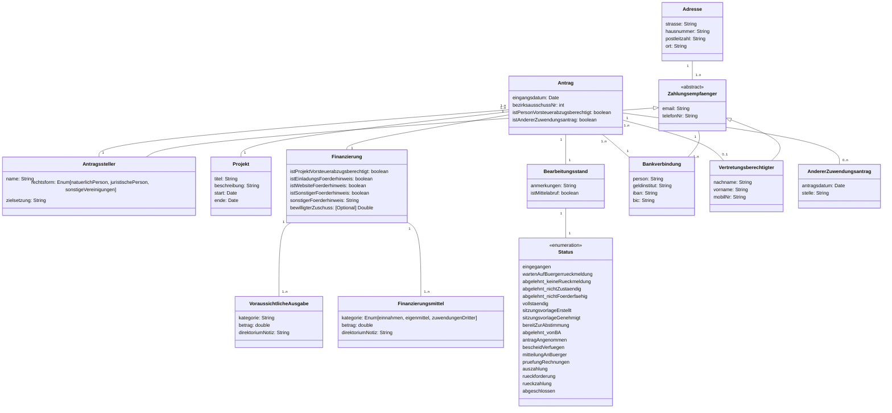

# Data model

```mermaid
classDiagram
    Antrag "1..n"--"1" Antragssteller
    Antrag "1..n"--"1" Projekt
    Antrag "1"--"1" Finanzierung
    Antrag "1" -- "1" Bearbeitungsstand
    Antrag "1..n"--"1" Bankverbindung
    Antrag "1..n"--"0..1" Vertretungsberechtigter
    Antrag "1" -- "0..n" AndererZuwendungsantrag
    Bearbeitungsstand "1"--"1" Status
    Finanzierung "1"--"1..n" VoraussichtlicheAusgabe
    Finanzierung "1"--"1..n" Finanzierungsmittel
    Adresse "1"--"1..n" Zahlungsempfaenger
    Zahlungsempfaenger "1"--"1..n" Bankverbindung
    Zahlungsempfaenger <|-- Vertretungsberechtigter
    Zahlungsempfaenger <|-- Antragssteller

    class Antrag{
        eingangsdatum: Date
        bezirksausschussNr: int
        istPersonVorsteuerabzugsberechtigt: boolean
        istAndererZuwendungsantrag: boolean
    }

    class Bearbeitungsstand{
        anmerkungen: String
        istMittelabruf: boolean
    }

    class AndererZuwendungsantrag{
        antragsdatum: Date
        stelle: String
    }

    class Projekt{
        titel: String<fk>
        beschreibung: String<fk>
        start: Date<fk>
        ende: Date<fk>
        %% All attributes except UUID are <fk>
    }

    class Bankverbindung{
        person: String<fk>
        geldinstitut: String<fk>
        iban: String<fk>
        bic: String<fk>        
        %% All attributes except UUID are <fk>
    }

    class Finanzierung{
        istProjektVorsteuerabzugsberechtigt: boolean
        istEinladungsFoerderhinweis: boolean
        istWebsiteFoerderhinweis: boolean
        istSonstigerFoerderhinweis: boolean
        sonstigerFoerderhinweis: String
        bewilligterZuschuss: [Optional] Double
    }

    class Antragssteller{
        name: String<fk>
        rechtsform: Enum[natuerlichPerson, juristischePerson, sonstigeVereinigungen]<fk>
        zielsetzung: String<fk>
        %% All attributes except UUID are <fk>
    }

    class Adresse{
        strasse: String<fk>
        hausnummer: String<fk>
        postleitzahl: String<fk>
        ort: String<fk>
        %% All attributes except UUID are <fk>
    }

    class Vertretungsberechtigter{
        nachname: String<fk>
        vorname: String<fk>
        mobilNr: String<fk>
        %% All attributes except UUID are <fk>
    }

    class VoraussichtlicheAusgabe{
        kategorie: String
        betrag: double
        direktoriumNotiz: String
    }

    class Finanzierungsmittel{
        kategorie: Enum[einnahmen, eigenmittel, zuwendungenDritter]
        betrag: double
        direktoriumNotiz: String
    }

    class Zahlungsempfaenger{
        <<abstract>>
        email: String<fk>
        telefonNr: String<fk>
        %% All attributes except UUID are <fk> (including child-attributes)
    }

    class Status {
        <<enumeration>>
        eingegangen
        wartenAufBuergerrueckmeldung
        abgelehnt_keineRueckmeldung
        abgelehnt_nichtZustaendig
        abgelehnt_nichtFoerderfaehig
        vollstaendig
        sitzungsvorlageErstellt
        sitzungsvorlageGenehmigt
        bereitZurAbstimmung
        abgelehnt_vonBA
        antragAngenommen
        bescheidVerfuegen
        mitteilungAnBuerger
        pruefungRechnungen
        auszahlung
        rueckforderung
        rueckzahlung
        abgeschlossen
    }
```
