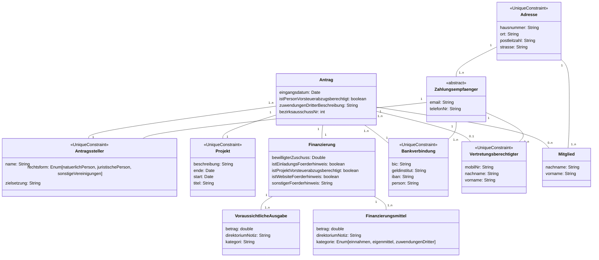

# Data model

```mermaid
classDiagram
    Antrag "1..n"--"1" Antragssteller
    Antrag "1"--"1" Projekt
    Antrag "1"--"1" Finanzierung
    Antrag "1..n"--"1" Bankverbindung
    Antrag "1..n"--"0..1" Vertretungsberechtigter
    Antrag "1"--"0..n" Mitglied
    Finanzierung "1"--"1..n" VoraussichtlicheAusgabe
    Finanzierung "1"--"1..n" Finanzierungsmittel
    Adresse "1"--"1..n" Mitglied
    Adresse "1"--"1..n" Zahlungsempfaenger
    Zahlungsempfaenger "1"--"1..n"Bankverbindung
    Zahlungsempfaenger "1"--"1..n"Vertretungsberechtigter
    Zahlungsempfaenger "1"--"1..n"Antragssteller

    class Antrag{
        eingangsdatum: Date
        istPersonVorsteuerabzugsberechtigt: boolean
        zuwendungenDritterBeschreibung: String
        bezirksausschussNr: int
    }

    class Projekt{
        <<UniqueConstraint>>
        beschreibung: String
        ende: Date
        start: Date
        titel: String
    }

    class Bankverbindung{
        <<UniqueConstraint>>
        bic: String
        geldinstitut: String
        iban: String
        person: String
    }

    class Finanzierung{
        bewilligterZuschuss: Double
        istEinladungsFoerderhinweis: boolean
        istProjektVorsteuerabzugsberechtigt: boolean
        istWebsiteFoerderhinweis: boolean
        sonstigerFoerderhinweis: String
    }

    class Antragssteller{
        <<UniqueConstraint>>
        name: String
        rechtsform: Enum[natuerlichPerson, juristischePerson, sonstigeVereinigungen]
        zielsetzung: String
    }

    class Adresse{
        <<UniqueConstraint>>
        hausnummer: String
        ort: String
        postleitzahl: String
        strasse: String
    }

    class Vertretungsberechtigter{
        <<UniqueConstraint>>
        mobilNr: String
        nachname: String
        vorname: String
    }

    class VoraussichtlicheAusgabe{
        betrag: double
        direktoriumNotiz: String
        kategori: String
    }

    class Finanzierungsmittel{
        betrag: double
        direktoriumNotiz: String
        kategorie: Enum[einnahmen, eigenmittel, zuwendungenDritter]
    }

    class Mitglied{
        nachname: String
        vorname: String
    }

    class Zahlungsempfaenger{
        <<abstract>>
        email: String
        telefonNr: String
    }
```
