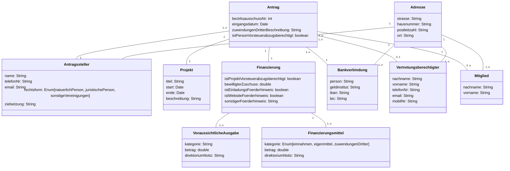

# Data model

```mermaid
classDiagram
    Antrag "1..n"--"1" Antragssteller
    Antrag "1"--"1" Projekt
    Antrag "1"--"1" Finanzierung
    Antrag "1..n"--"1" Bankverbindung
    Antrag "1..n"--"0..1" Vertretungsberechtigter
    Antrag "1..n"--"0..n" Mitglied
    Finanzierung "1"--"1..n" VoraussichtlicheAusgabe
    Finanzierung "1"--"1..n" Finanzierungsmittel
    Adresse "1"--"1..n" Antragssteller
    Adresse "1"--"1..n" Vertretungsberechtigter
    Adresse "1"--"1..n" Bankverbindung
    Adresse "1"--"1..n" Mitglied

    class Antrag{
        bezirksausschussNr: int
        eingangsdatum: Date
        zuwendungenDritterBeschreibung: String
        istPersonVorsteuerabzugsberechtigt: boolean
    }

    class Projekt{
        titel: String
        start: Date
        ende: Date
        beschreibung: String
    }

    class Bankverbindung{
        person: String
        geldinstitut: String
        iban: String
        bic: String
    }

    class Finanzierung{
        istProjektVorsteuerabzugsberechtigt: boolean
        bewilligterZuschuss: double
        istEinladungsFoerderhinweis: boolean
        istWebsiteFoerderhinweis: boolean
        sonstigerFoerderhinweis: String
    }

    class Antragssteller{
        name: String
        telefonNr: String
        email: String
        rechtsform: Enum[natuerlichPerson, juristischePerson, sonstigeVereinigungen]
        zielsetzung: String
    }

    class Adresse{
        strasse: String
        hausnummer: String
        postleitzahl: String
        ort: String
    }

    class Vertretungsberechtigter{
        nachname: String
        vorname: String
        telefonNr: String
        email: String
        mobilNr: String
    }

    class VoraussichtlicheAusgabe{
        kategorie: String
        betrag: double
        direktoriumNotiz: String
    }

    class Finanzierungsmittel{
        kategorie: Enum[einnahmen, eigenmittel, zuwendungenDritter]
        betrag: double
        direktoriumNotiz: String
    }

    class Mitglied{
        nachname: String
        vorname: String
    }
```
