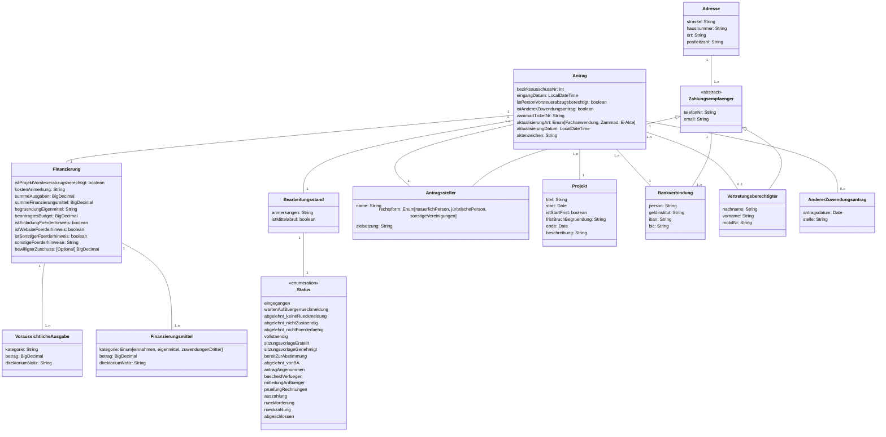

# Data model

```mermaid
classDiagram
    Antrag "1" -- "1" Finanzierung
    Antrag "1" -- "1" Bearbeitungsstand
    Antrag "1..n" -- "1" Antragssteller
    Antrag "1..n" -- "1" Projekt
    Antrag "1..n" -- "1" Bankverbindung
    Antrag "1..n" -- "0..1" Vertretungsberechtigter
    Antrag "1" -- "0..n" AndererZuwendungsantrag
    Bearbeitungsstand "1" -- "1" Status
    Finanzierung "1" -- "1..n" VoraussichtlicheAusgabe
    Finanzierung "1" -- "1..n" Finanzierungsmittel
    Adresse "1" -- "1..n" Zahlungsempfaenger
    Zahlungsempfaenger "1" -- "1..n" Bankverbindung
    Zahlungsempfaenger <|-- Vertretungsberechtigter
    Zahlungsempfaenger <|-- Antragssteller

    class Antrag {
        bezirksausschussNr: int
        eingangDatum: LocalDateTime
        istPersonVorsteuerabzugsberechtigt: boolean
        istAndererZuwendungsantrag: boolean
        zammadTicketNr: String
        aktualisierungArt: Enum[Fachanwendung, Zammad, E-Akte]
        aktualisierungDatum: LocalDateTime
        aktenzeichen: String
    }

    class Bearbeitungsstand {
        anmerkungen: String
        istMittelabruf: boolean
    }

    class AndererZuwendungsantrag {
        antragsdatum: Date
        stelle: String
    }

    class Projekt {
        titel: String<fk>
        start: Date<fk>
        istStartFrist: boolean
        fristBruchBegruendung: String
        ende: Date<fk>
        beschreibung: String<fk>
    %% All attributes except UUID are <fk>
    }

    class Bankverbindung {
        person: String<fk>
        geldinstitut: String<fk>
        iban: String<fk>
        bic: String<fk>
    %% All attributes except UUID are <fk>
    }

    class Finanzierung {
        istProjektVorsteuerabzugsberechtigt: boolean
        kostenAnmerkung: String
        summeAusgaben: BigDecimal
        summeFinanzierungsmittel: BigDecimal
        begruendungEigenmittel: String
        beantragtesBudget: BigDecimal
        istEinladungFoerderhinweis: boolean
        istWebsiteFoerderhinweis: boolean
        istSonstigerFoerderhinweis: boolean
        sonstigeFoerderhinweise: String
        bewilligterZuschuss: [Optional] BigDecimal
    }

    class Antragssteller {
        name: String<fk>
        rechtsform: Enum[natuerlichPerson, juristischePerson, sonstigeVereinigungen]<fk>
        zielsetzung: String<fk>
    %% All attributes except UUID are <fk>
    }

    class Adresse {
        strasse: String<fk>
        hausnummer: String<fk>
        ort: String<fk>
        postleitzahl: String<fk>
    %% All attributes except UUID are <fk>
    }

    class Vertretungsberechtigter {
        nachname: String<fk>
        vorname: String<fk>
        mobilNr: String<fk>
    %% All attributes except UUID are <fk>
    }

    class VoraussichtlicheAusgabe {
        kategorie: String
        betrag: BigDecimal
        direktoriumNotiz: String
    }

    class Finanzierungsmittel {
        kategorie: Enum[einnahmen, eigenmittel, zuwendungenDritter]
        betrag: BigDecimal
        direktoriumNotiz: String
    }

    class Zahlungsempfaenger {
        <<abstract>>
        telefonNr: String<fk>
        email: String<fk>
    %% All attributes except UUID are <fk> (including child-attributes)
    }

    class Status {
        <<enumeration>>
        eingegangen
        wartenAufBuergerrueckmeldung
        abgelehnt_keineRueckmeldung
        abgelehnt_nichtZustaendig
        abgelehnt_nichtFoerderfaehig
        vollstaendig
        sitzungsvorlageErstellt
        sitzungsvorlageGenehmigt
        bereitZurAbstimmung
        abgelehnt_vonBA
        antragAngenommen
        bescheidVerfuegen
        mitteilungAnBuerger
        pruefungRechnungen
        auszahlung
        rueckforderung
        rueckzahlung
        abgeschlossen
    }
```
