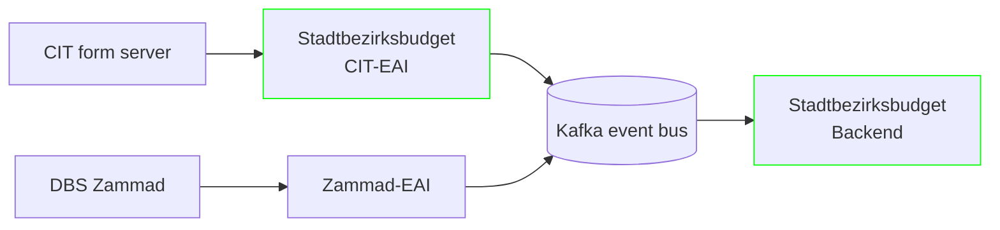

# Reliable communication

For this project, reliable communication between the individual components is required. The CIT form server, DBS (Zammad), and the Stadtbezirksbudget
application must
be interconnected. In particular, the reliability and fault tolerance of the communication between CIT and the application are crucial, as incoming
citizen applications must never be lost.

For this reason, we are using the Kafka event bus. It is operated centrally and with high availability, ensuring reliability without requiring the
Stadtbezirksbudget
application itself to be fault-tolerant.

Only the CIT-EAI and the Stadtbezirksbudget application are maintained as part of this project. All other components are operated by other departments.
