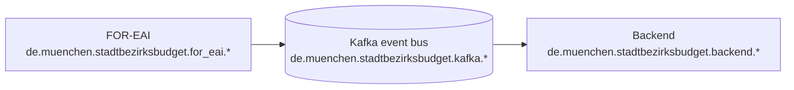

# Reliable communication

For this project, reliable communication between the individual components is required. The CIT form server, DBS (Zammad), and the Stadtbezirksbudget
application must
be interconnected. In particular, the reliability and fault tolerance of the communication between CIT and the application are crucial, as incoming
citizen applications must never be lost.

For this reason, we are using the Kafka event bus. It is operated centrally and with high availability, ensuring reliability without requiring the
Stadtbezirksbudget application itself to be high available.

Only the FOR-EAI and the Stadtbezirksbudget application are maintained as part of this project. All other components are operated by other departments.

## Event structure

The communication between the components is based on events. Each event has a key, a value and headers:

- The key is used to determine the partition in Kafka.
- The value contains the actual data of the event.
- The headers contain metadata about the event like `__TypeId__` which identifies the class serialized in the value.

### Class mapping

Because we use different packages in the different components, we need to map the classes to each other. This is done by configuring the
`spring.kafka.properties.spring.json.type.mapping` property in the `application.yml` of the components.

It maps the produced class (in package `de.muenchen.stadtbezirksbudget.for_eai.*`) to a transfer class (in package `de.muenchen.stadtbezirksbudget.kafka.*`) and
further in the backend to the consumed class (in package `de.muenchen.stadtbezirksbudget.backend.*`).

