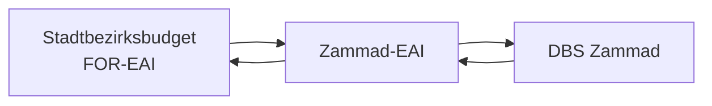

# Zammad Integration

The Zammad integration is utilized to create tickets, users and more within the Zammad system.

## Generated API Client

The package for the API client is `de.muenchen.stadtbezirksbudget.for_eai.zammad.generated` and it is designed to integrate the for-eai with the Zammad EAI (Enterprise Application Integration). This enables seamless connection and interaction with the Zammad API.
The API client is generated using the OpenAPI Maven generator based on the openapi-spec.json file (located inside the resources folder in the for-eai). This file contains the OpenAPI specification, which defines the endpoints, methods, parameters, and models of the Zammad EAI.

## Authentication

The client is authenticated as a service account using the OAuth 2.0 Client Credentials Flow. Authentication against the Zammad EAI is performed using a Bearer token.
To ensure proper functionality, the service account roles must be enabled in the client.
